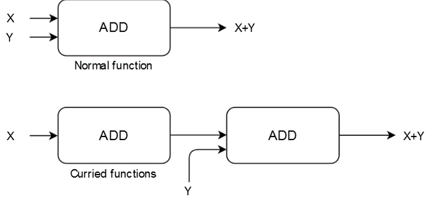
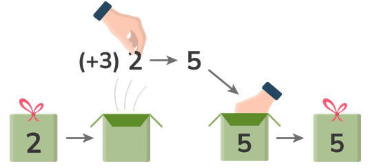

## Functional Programming
In any programming language, functions are said to be **first-class citizens** if they can be treated like any other variable. For instance, they can be passed as an argument to other functions, can be returned by another function, and can be assigned as a value to a variable.

What are not the advantages of types? Types make code compilation faster.

In functional programming, we write programs by letting objects interact with each other is a myth.

What are the advantages of functional programming?

- [x] Functional programming helps us deal with parallel programming.
- [x] Functional programming makes managing complex applications easier.

To write functional code in JavaScript, we can turn to **libraries such as Lodash, Ramda, or Folktale.**
We’ve already discussed Ramda Ramda and Folktale, but unfortunately, they’re insufficient. Ramda lacks the extremely useful concept of monads, on which several more advanced functional programming techniques are based. Folktale is a small library with some of the essential monads, but it has very few other features. It lacks some more powerful functional programming features like monad transformers. Another disadvantage of Folktale is that the library hasn’t received much support during the last few years.

Instead, we’ll use a TypeScript library called **fp-ts**. It has several advantages:

- [x] It’s written in TypeScript.
- [x] It has many stars on GitHub.
- [x] It’s actively maintained.
- [x] It has powerful monads.
- [x] It has an ecosystem of libraries that add even more functionality.

### Statement vs Expression
What is the difference between a statement and an expression?
An expression always produces a value; a statement does not.

## Setup
However, be sure to set the target property in tsconfig.json no lower than es6. Later on, we will use webpack to build our output and show the tsconfig.json file that goes with that setup.

```bash
pnpm i --save fp-ts@~2.8.6
```


## Closure
Closures can be used to **hide information** from other functions.
The behaviour depicted in the code snippet below is called closure. With closures, the inner function has access to all the information available in the outer function. This is why the value of the parameter outer is still available when we call ourInnerFunction that was returned from withInnerFunction.
The functions receiving or returning other functions are called **higher-order functions**.

```ts
function withInnerFunction(outer) {
    return function ourInnerFunction(inner) {
        console.log(`Outer function received ${outer}, inner got ${inner}`);
    };
}

const returnedFunction = withInnerFunction('a');

// some time later in our program, we actually need to call returnedFunction 
returnedFunction('b');
```

To:

```ts
const withInnerFunction = (outer) => (inner) => console.log(`Outer function received ${outer}, inner ${inner}`);
const returnedFunction = withInnerFunction('a');
returnedFunction('b');
```

This is interesting because it allows us to pass additional information that might **serve as an environment or state into our function.** Closures and first-class functions allow for more interesting behavior such **as creating factories for building functions, keeping parameter lists short, reducing code duplication, and so on**. Furthermore, *closures are the only way to make a variable private in JavaScript because we can circumvent all the other methods.*


Note: Arrow functions are essentially the same as functions defined using the function keyword, except when it comes to the this keyword. However, we will not use the this keyword in this course.


### ADTs | Pipes
Algebraic data types (ADTs) in functional programming can be extremely useful. We’ll discuss them in detail later on. However, in TypeScript, we can use **discriminating unions (also called tagged unions) to get sum types**. These sum types are a category of ADTs, and creating them does require a bit of ceremony, though. In a language like Haskell, we can make very powerful pattern matching on sum types. There are libraries in the fp-ts ecosystem that try to add some of this power to TypeScript, e.g., **morphic-ts**. However, TypeScript can already do some cool things with these unions.


## Pure Function
A pure function is one with a result that’s based solely on the input it receives. So, as long as the input doesn’t change, the output doesn’t change either. This means that it has **no side effects**.

## Referential Transparency
A related concept, referential transparency, also helps us in coding. It means that we can replace a function call with the value it produces. 

```ts
function biggerProgram() {
    const result = addOne(5);
    return result * 2;
}
```

## Immutability

Immutability is another frequently mentioned element of functional programming. **Instead of changing our existing data structures, we create new data structures** whenever we change any information. This makes reasoning easier. No other process could’ve changed the array we just received from our function because it’s an entirely new data structure! We can see another obvious advantage of immutability in parallel programming. In the words of Adam Smith, “Threads coming together with mutable data ends in a conspiracy against your sanity”.

Note: Even when we’re not doing any fancy parallel programming, some easily **missed mutability bugs can waste our time**. For instance, *let’s assume we have arrays of the const type, and we’re using shift to get the first element of those arrays. The usage of shift mutates our arrays in place. Such bugs can cause problems within our program.*

**Performance may suffer in some cases**, especially when our language isn’t written for immutability. As always, this is a matter of trade-offs. Is excellent performance essential, or is the combination of a lack of bugs, easier maintenance, and decent performance acceptable?

Note: **JavaScript, sadly, wasn’t written with immutability in mind**. Therefore, several *libraries offer to add immutable data structures.* It’s better to have the language handle everything for us, though, despite the loss of immutability.

## Declarative programming style
Functional programming tries to lift this behavior to a higher level of **abstraction**. Whenever possible, the low-level behavior is left to the computer.
First, functional programming offers a more **declarative** style of programming. Object-oriented programming has an **imperative** feel because our program consists of a list of instructions to execute (or objects to execute). 
Declarative: I want a dinner with chicken.
Imperative: Kitchen -> Open Fridge ->  Removing Chicken from Fridge -> Dinner on the table.

Declarative example:

```ts
const exampleArray = [1, 2, 3, 4];

function addOneToEach(arr) {
    for(let i = 0; i < arr.length; i++) {
        arr[i] = arr[i] + 1; //mutable data structures
    }
    return arr;
}

console.log(addOneToEach(exampleArray));
```

Imperative example:

```ts
const exampleArray = [1, 2, 3, 4];

function fpAddOneToEach(arr) {
    return arr.map(el => el + 1); // add 1 to each element of array, immutable data structures
}

console.log(fpAddOneToEach(exampleArray));
```

**Another advantage of higher-order functions is that they often use immutable data structures**. 
**The loop in the first example above, on the other hand, mutates the existing array and is error prone(imperative)**

Note: Modify the second code snippet above and include the loop version (from the first example), followed by the functional programming version (from the second example). Notice how the functional programming version now returns [3, 4, 5, 6] instead of [2, 3, 4, 5]. This is because the exampleArray has been modified by the loop version.

## Tacit programming
Recall composition and our addOne function from an earlier example. Using it within map is trivial, as shown below.

```ts
const exampleArray = [1, 2, 3, 4];

function addOne(el) {
    return el + 1;
}

function fpAddOneToEach(arr) {
    return arr.map(addOne);
}

console.log(fpAddOneToEach(exampleArray));
```

The above is called **point-free style or tacit programming**. The function we passed in expects one argument, and map produces one. We don’t have to write `el => addOne(el)` because JavaScript knows it has to pass the incoming value to the function.

So, with **higher-order functions like filter and map**, *we only have to write logic that filters or transforms a single element. The rest is handled by the higher-order function*. 
We know how to increment a single value, and we can now handle arrays without writing any additional code!

Additionally, in functional languages, maps are available for more than just arrays, further extending the usefulness of this function. Because functions like **map and filter are more abstract** and less bound to specifics, they can be applied in many situations. They work with any kind of array we throw at them. In contrast, the object methods only know how to do things for one specific class. 

`The corresponding Javadoc mentions the following:`

- [x] Stream pipeline results may be **nondeterministic or incorrect** if the behavioral parameters to the **stream operations are stateful**.
- [x] Side effects in behavioral parameters to stream operations are, in general, discouraged, as they can often lead to unwitting violations of the statelessness requirement, as well as other thread-safety hazards.

In summary, choose pure functions for reliable behavior when using streams. The Javadoc notes in several locations that this is also a requirement for parallelism, for reasons that are no longer a mystery. That is, pure functions behave in a predictable fashion. However, with side effects and mutations, the result might be unpredictable.


## Recursion
Recursion is another way that functional programming deals with repetition and avoiding loops. Recursion means **solving a problem by breaking it up into smaller problems**.

Recursion often leads to elegant solutions for complicated problems. However, it’s not frequently used in mainstream languages like JavaScript because the **repeated function calls cause the stack to grow**, possibly resulting in a stack overflow. In this course, we’ll mainly use **higher-order functions to solve problems involving repetition.**


## Higher-order functions and composition

**The composition order (right to left)** is probably inspired by mathematics. That is, if we have an f(g(x)) function, we first calculate g(x) and pass the result, y, to the outer function, f(y).

Abstraction makes the program cleaner, shorter, and reusable.

we created new functionality out of existing functions, similar to what we did with map and filter. The composition has several nice qualities to it. For one, we don’t have to change our existing functions. Instead, our new functionality is created out of existing code

```ts
const compose = (...fns) => (...args) => {
    return fns.reduceRight((res, fn) => [fn.call(null, ...res)], args)[0];
};

const coolName = (name) => `${name} a.k.a. King`;
const yelling = (name) => name.toUpperCase();
const yellingACoolerName = compose(yelling, coolName);
const result = yellingACoolerName('sam'); //Line 10
console.log(result); //Output: SAM A.K.A. KING
```

Line 10: We start with a reduceRight on our array of functions. First up is coolName, which receives the sam parameter as the preliminary result. The function is called and adds a cool suffix to the name. Next, our reduce starts working on the yelling function. It, too, receives a preliminary result, which is the name with the suffix that was just added. It returns this parameter in uppercase.

`Note:`
For those with Linux experience, this type of composition is similar to the Unix Philosophy of piping. That is, to work with small programs that do one thing well and use pipes to combine them to form larger functionality. As those familiar with Bash will know, the versatility and power of piping, using only basic Unix components, is impressive.

### Information hiding using composition
**We can also use composition for information hiding**. For example, we could decide to only expose yellingACoolerName, hiding the functions it’s made of. Because we don’t use classes, modules provide our most important means of hiding information.

## What is currying?

Currying involves **converting** the function, **combining** multiple arguments into a series of functions that are executed one after another.

Whenever we feed it an argument, we can write a function that returns another function that also accepts an argument and returns a function. **This continues to happen until the final argument is passed**. When that happens, the code block executes. This is called currying, and it’s very popular in functional languages like Haskell and F#. The following code snippet is a boilerplate example of currying:

```ts
const decrypt = (m) => `{ "userType": "admin", "message": "${m}" }`;
const userTypeLens = (fallback) => (userInfo) => userInfo.userType || fallback;
const auth = (type) => type === 'admin' ? ({ allow: true }) : ({ allow: false }); //Line 3
const userTypeLensDefaultNone = userTypeLens('none'); //Line 7
const compose = (...fns) => (...args) => {
    return fns.reduceRight((res, fn) => [fn.call(null, ...res)], args)[0];
};

//Remember to read from right to left or bottom to top
const authAnswer = compose(
    JSON.stringify,
    auth,
    userTypeLensDefaultNone,
    JSON.parse,
    decrypt,
);

console.log(authAnswer('a message'));
```

Line 3: Here, we retrieve a field from the incoming argument, userInfo, and return a fallback if the field is missing. Lenses in functional programming are used to retrieve or change data in a data structure. They make it easy to modify a single value within immutable, complicated structures. Real lenses such as “monocle-ts” are more complicated than this example.

Line 7: We fill in our fallback value, which is the string none.

`Note:`
Closely linked to **currying is the partial application**, which feeds a functioning part of the arguments it needs at a given time and calls the function with the remaining arguments later. Python has a function called partial that can help us accomplish the same result.


#### Why is currying useful?
Currying allows us to **add configurations or dependencies to a function** at one point and call it at a later time. We ensure that our function has everything it needs to run correctly. It merely has to wait for the final input data for execution. Furthermore, currying can make our code easier to understand when dealing with functions that take many arguments. There’s another reason for currying in the composition context. In our example above, each function we use inside the authAnswer requires one argument. Conveniently, all our functions return one value, namely a string, boolean, or an object, making them easy to compose.

## Combining Currying and Composition

Learn how to use currying and composition together for functions that take multiple arguments.

### Function with one parameter value

Composing is easy when we have a scenario like this:

- [x] Function ONE accepts a parameter of type A and returns a value of type B.
- [x] Function TWO accepts a parameter of type B and returns a value of type C.
- [x] Function THREE accepts a parameter of type C and returns a value of type D.

Note: In a Haskell or F# type of notation, the signatures of the functions above will be as follows:

```md
ONE :: A -> B
TWO :: B -> C
THREE :: C -> D
COMBINED :: A -> D
```

### Function with multiple parameter values

`Example of currying:`

```ts
const TWO = (first) => (second) => {
    if(first && second) {
        return 'ok';
    }
    throw Error('Did not receive two params!');
}
const twoWhichWeWillPassToThree = TWO('first argument already given');
console.log(twoWhichWeWillPassToThree('giving second argument'));
```

Rewriting the above, we have:

```md
ONE :: A -> C
TWO :: B -> C -> D
THREE :: D -> E
COMBINED :: A -> E
```

This can’t be combined, so we give function TWO a value B, which returns a new function for us to use: `FUNCTION_RETURNED_BY_TWO :: C -> D`.

This fits perfectly. Currying can be a huge help when composing functions with input and output values that are mismatched. We give what we can, and the rest will be filled in later. Consequently, a function’s final argument is often the data we’re operating on, while earlier arguments consist of things like configuration and dependencies. This is because we’ll usually already know what those configurations or dependencies will be. However, we only know what the data looks like when we receive it.




Note: Though they occasionally get in the way, types are generally very useful when composing functions. If a function expects type A and we instead feed it a function that returns A, it will complain. Meanwhile, JavaScript accepts everything we throw at it and crashes at runtime. In our example(fp-ex15.ts), try using `userTypeLens` (line 3) instead of the partially applied variant `userTypeLensDefaultNone` (line 7). JavaScript now returns `{ allow: false }`, despite receiving an admin.

## Problems with Currying and Composition

### Asynchronous actions
Now, we know how to compose functions to create our software. We also know how currying can help with functions that don’t naturally fit together because they have the wrong types or number of parameters. However, we’ll still have some issues with TypeScript and JavaScript. The most important issue might be that a lot happens asynchronously. Take a look at the following code snippet:

```ts
const compose = (...fns) => (...args) => {
    return fns.reduceRight((res, fn) => [fn.call(null, ...res)], args)[0];
};
const givesAPromise = (num) => Promise.resolve(num);
const doubleIt = (num) => num * 2;
const doubled = compose(doubleIt, givesAPromise);
console.log(doubled(2)); // Output NaN 
```
 How do we fix it? If we want to write pure JavaScript, we could use then(), which is provided by Promise, to retrieve a result to work with. This is certainly not a bad idea. However, we might run into some limits and, more generally, our entire program will have to use Promises everywhere.

## What are monads?
How can we avoid exceptions? How will we handle error cases without them? If Promises aren’t ideal for asynchronous behavior, what should we use instead? Enter the dreaded monads!
In several functional languages, putting the `value inside the monad is called return`. But, because return is a keyword in JavaScript, we’ll find various other words for it, like `of`.

- [x] Monads can be compared to a container.
- [x] The various constructors for monads in fp-ts are called lifting functions.

## Functors

We have a value inside a container. What does that get us? Well, monads have several functions that influence or change that value. For example, the monad function map takes a function that might be applied to the value inside the container. Why do we say “might”?

`Note:`
Technically, monads only define bind, chain, or flatmap methods, but not a map, which is part of the definition of a Functor. However, monads are functors, so our current explanation is good enough.




### Option monad

An example might make things easier to understand. Let’s take a look at the Option monad from fp-ts.

#### The map function


```ts
import {getOrElse, map, none, some} from "fp-ts/lib/Option";
const upperCaseIt = (value: string) => value.toUpperCase();
const optionWithAString = some('a value');
const optionEmpty = none;
const upperCased = map(upperCaseIt)(optionWithAString);
const upperCasedEmpty = map(upperCaseIt)(optionEmpty);
console.log(getOrElse(() => 'no value present')(upperCased));
console.log(getOrElse(() => 'no value present')(upperCasedEmpty));
```
